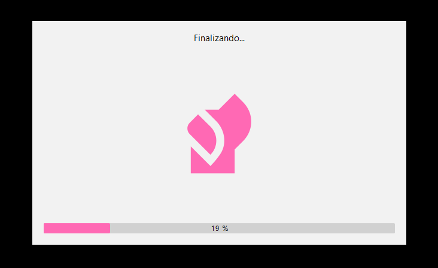
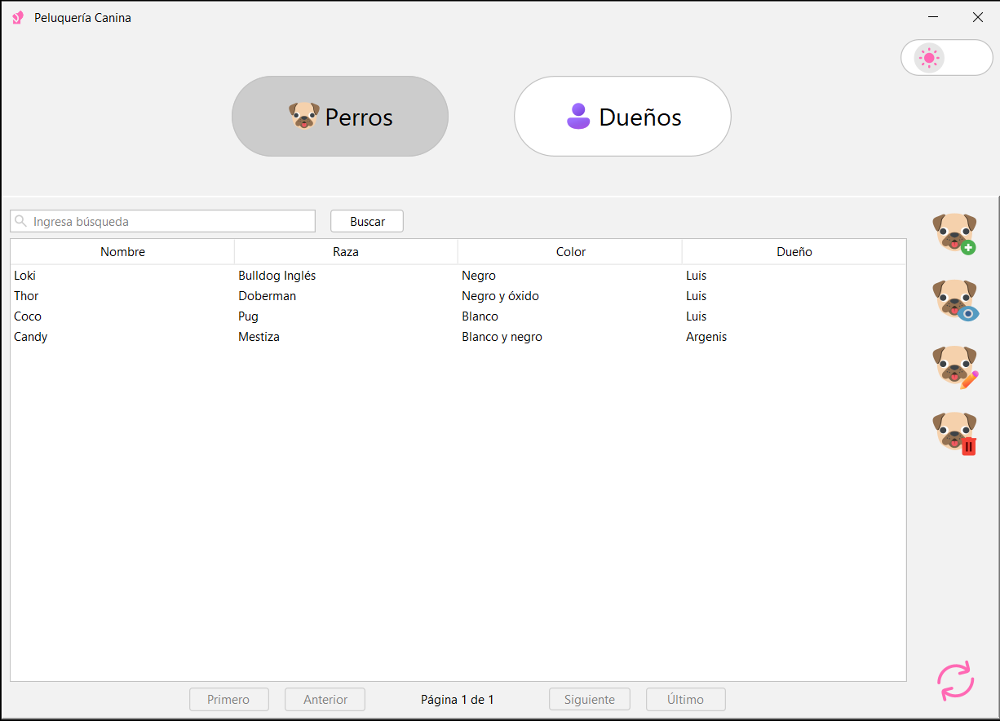
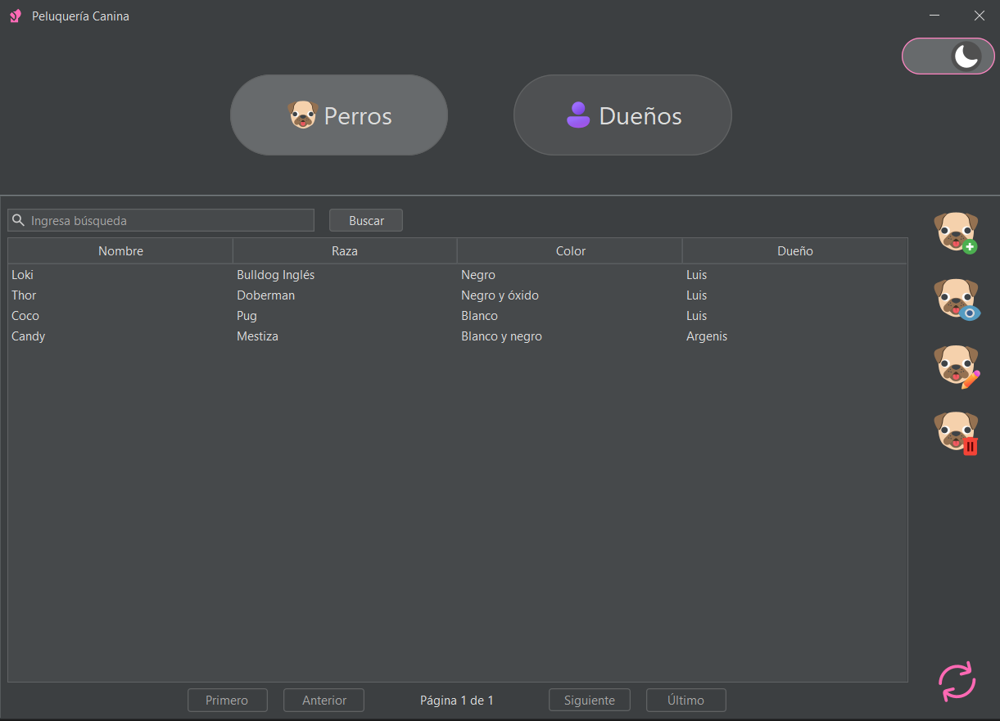
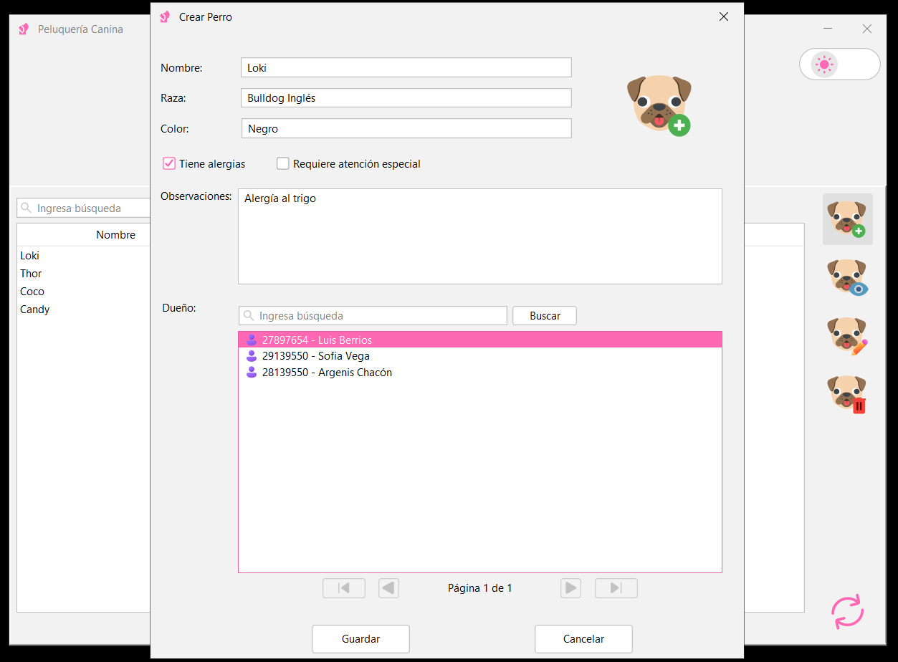
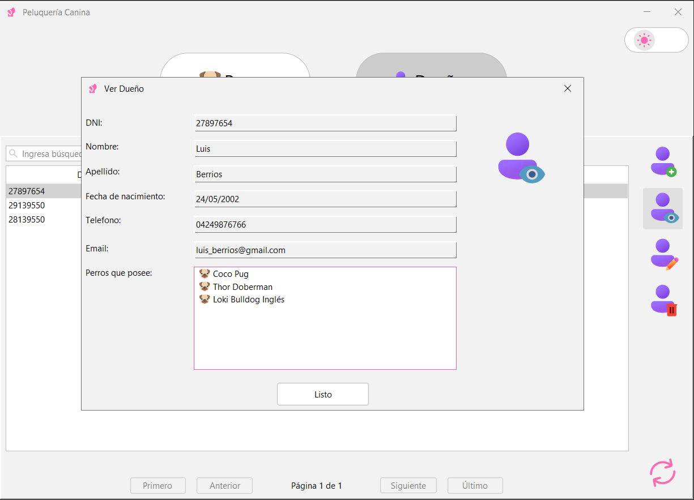
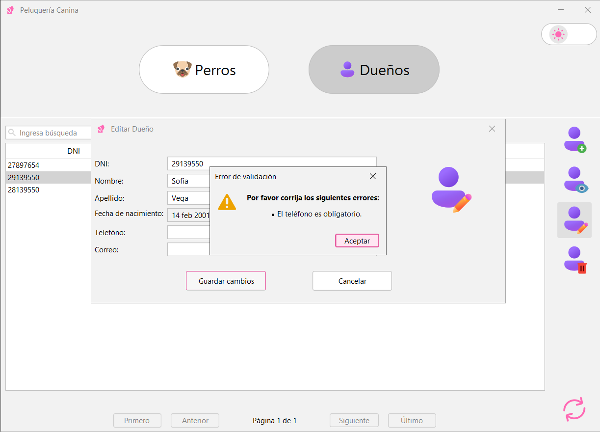

# Dog Grooming


Una aplicación de escritorio portable para la gestión de peluquería canina, desarrollada en Java con interfaz gráfica
Swing moderna. Permite administrar dueños y sus mascotas, con una base de datos embebida H2 para portabilidad completa.

## Capturas de Pantalla

|               Splash Screen                |              Modo claro              |             Modo oscuro             |
|:------------------------------------------:|:------------------------------------:|:-----------------------------------:| 
|  |  |  | 

|              Crear Perro              |              Ver Dueño              |             Validaciones              | 
|:-------------------------------------:|:-----------------------------------:|:-------------------------------------:|
|  |  |  |

## Características

- **Gestión de Dueños**: Crear, editar, ver y eliminar dueños.
- **Gestión de Perros**: Crear, editar, ver y eliminar perros.
- **Interfaz Moderna**: Utiliza FlatLaf para un look and feel moderno y personalizable.
- **Cambio de Tema**: Funcionalidad para alternar entre modo claro y oscuro.
- **Base de Datos Embebida**: H2 database para portabilidad sin necesidad de servidor externo.
- **Validaciones**: Integración con Jakarta Validation para datos consistentes.
- **Logging**: Configurado con Logback para seguimiento de eventos.

## Tecnologías Utilizadas

- **Java 21**: Lenguaje principal.
- **Maven**: Gestión de dependencias y build.
- **JPA (EclipseLink)**: Persistencia de datos.
- **Swing + FlatLaf**: Interfaz gráfica.
- **H2 Database**: Base de datos embebida.
- **Jakarta Validation + Hibernate Validator**: Validaciones.
- **SLF4J + Logback**: Logging.
- **Lombok**: Reducción de boilerplate.
- **MapStruct**: Mapeo de objetos.
- **JCalendar**: Componentes de calendario.
- **Spinner Progress**: Componente de carga animado por [DJ-Raven](https://github.com/DJ-Raven/spinner-progress) (MIT
  License).

## Descargas y Releases

Descarga la versión más reciente desde la sección **[Releases](https://github.com/argenischacon/dog-grooming/releases)**
del repositorio.

- **DogGrooming-1.0.0.msi** (recomendado para Windows): Instalador nativo con progreso visible, opción para elegir
  carpeta de instalación, acceso directo en el Escritorio y entrada en el Menú Inicio.
- **dog-grooming-1.0.0.jar** (modo portable): Ejecuta la app sin instalación en cualquier carpeta o USB:
  ```bash
  java -jar dog-grooming-1.0.0.jar
  ```
  (Requiere Java 21 o superior instalado en el sistema).

La base de datos se crea automáticamente en el directorio home del usuario (`~/dog-grooming/data/doggrooming.mv.db` o
similar) para evitar problemas de permisos.

## Instalación desde Fuente (para desarrollo o contribución)

### Requisitos Previos

- **Java 21** o superior instalado.
- **Maven 3.6+** para gestión de dependencias.

### Pasos

1. Clona el repositorio:
   ```bash
   git clone https://github.com/argenischacon/dog-grooming.git
   cd dog-grooming
   ```

2. Compila el proyecto:
   ```bash
   mvn clean compile
   ```

3. Ejecuta la aplicación:
   ```bash
   mvn exec:java -Dexec.mainClass="com.argenischacon.DogGrooming"
   ```

   O genera un JAR ejecutable:
   ```bash
   mvn clean package
   java -jar target/dog-grooming-1.0.0.jar
   ```

## Uso

La aplicación se ejecuta como una aplicación de escritorio. Al iniciar, muestra una pantalla de splash mientras
inicializa la base de datos. Luego, presenta la interfaz principal para gestionar dueños y perros.

- **Agregar Dueño**: Usa el panel de dueños para crear nuevos registros.
- **Agregar Perro**: Asocia perros a dueños existentes.
- **Editar/Ver**: Selecciona registros para modificar o visualizar detalles.

La base de datos se crea automáticamente en `./data/doggrooming.mv.db` para portabilidad.

## Licencia

Este proyecto está bajo la Licencia MIT. Ver el archivo [LICENSE](LICENSE) para más detalles.

## Autor

**Argenis Chacón**

[](https://www.linkedin.com/in/argenischaconb)
[](https://github.com/argenischacon)

⭐ Si este proyecto te resultó útil, ¡dale una estrella!
